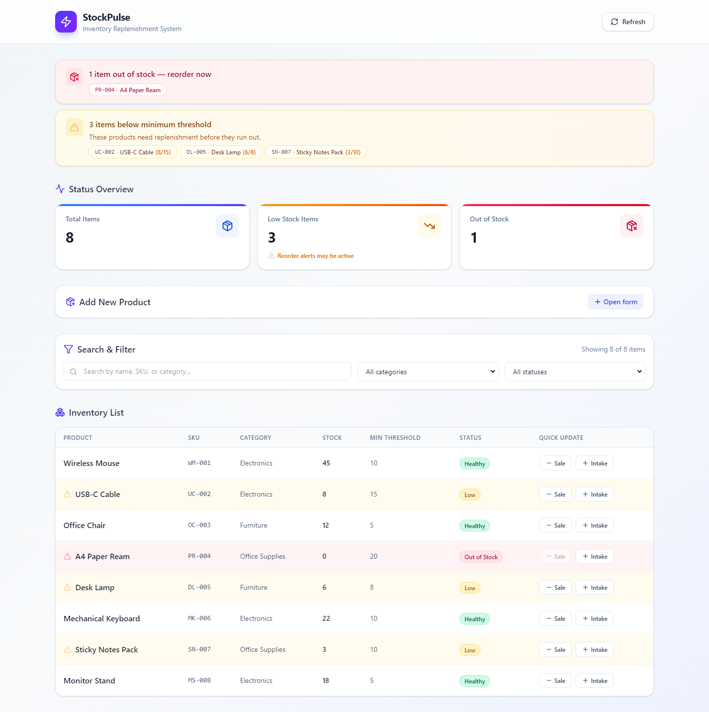
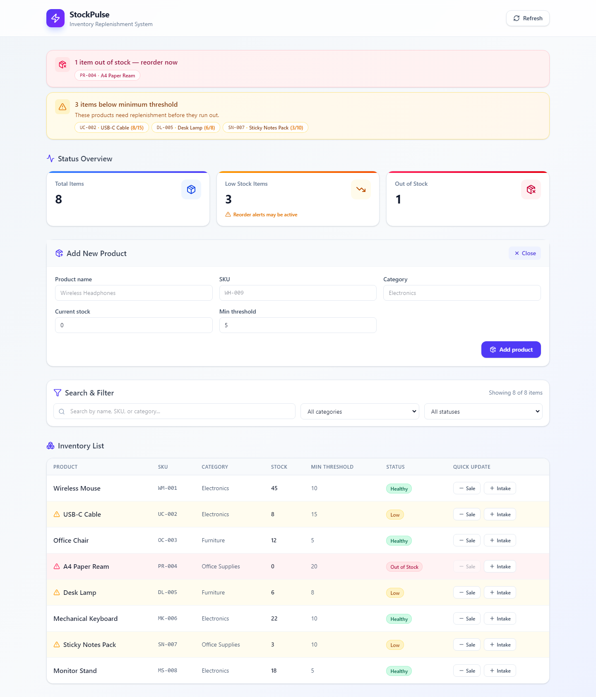
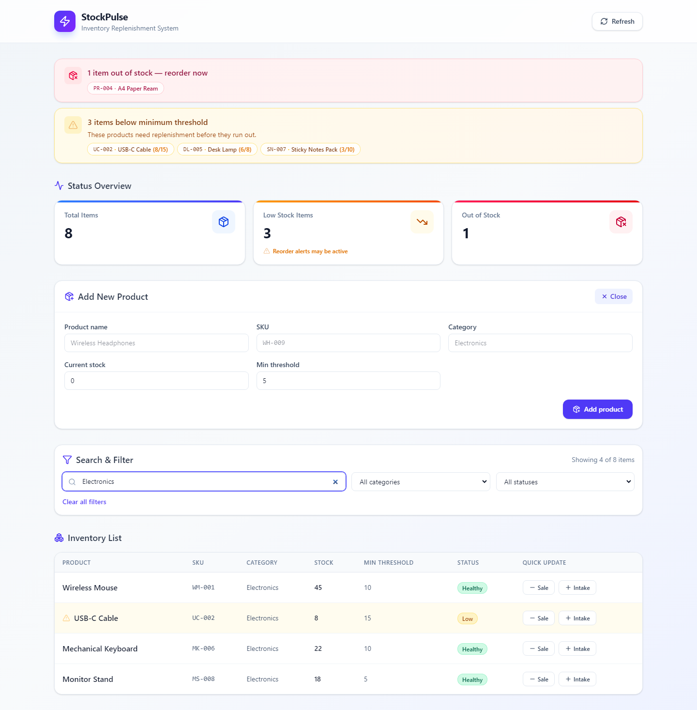

# StockPulse

Professional inventory replenishment dashboard with automatic low-stock alerts, search/filter, and product management. Built with **Spring Boot** and **React**.



## Features

- **Live status overview** — total items, low stock, and out-of-stock counts at a glance
- **Low-stock alert banners** — surfaces SKUs that need reordering directly on the dashboard
- **Add products from the UI** — create inventory without touching the API
- **Search & filter** — by name, SKU, category, or stock status
- **Quick stock adjustments** — simulate sales and intake with one click
- **Automatic status logic** — Healthy / Low / Out of Stock recalculated on every change

## Screenshots

| Dashboard | Add product form | Search & filter |
|-----------|------------------|-----------------|
|  |  |  |

## Tech Stack

| Layer    | Technology                                      |
|----------|-------------------------------------------------|
| Backend  | Java 21, Spring Boot 3.x, Spring Data JPA, H2   |
| Build    | Gradle                                          |
| Frontend | React (Vite), TypeScript, Tailwind CSS          |
| API      | REST / JSON                                     |
| Hosting  | Vercel (frontend) + Render (backend) — free tier |

## Project Structure

```
stockpulse-inventory/
├── backend/              # Spring Boot API
├── frontend/             # React dashboard
├── docs/screenshots/     # README images
├── render.yaml           # Render blueprint
└── scripts/              # Screenshot capture utility
```

## Prerequisites

- **JDK 21**
- **Node.js 18+**

## Running Locally

### Backend

```bash
cd backend
./gradlew bootRun        # Linux/macOS
gradlew.bat bootRun      # Windows
```

API: `http://localhost:8080/api/inventory`

### Frontend

```bash
cd frontend
npm install
npm run dev
```

Dashboard: `http://localhost:5173`

## API Endpoints

| Method | Endpoint                      | Description              |
|--------|-------------------------------|--------------------------|
| GET    | `/api/inventory`              | List all items           |
| GET    | `/api/inventory/summary`      | Status overview counts   |
| GET    | `/api/inventory/{id}`         | Get single item          |
| POST   | `/api/inventory`              | Create item              |
| PUT    | `/api/inventory/{id}`         | Update item              |
| POST   | `/api/inventory/{id}/adjust?delta=N` | Adjust stock (+/-) |
| DELETE | `/api/inventory/{id}`         | Delete item              |

## Stock Status Logic

- **Healthy** — `currentStock > minThreshold`
- **Low** — `0 < currentStock <= minThreshold`
- **Out of Stock** — `currentStock <= 0`

Status is recalculated on create, update, and stock adjustments. Low/out-of-stock transitions trigger server-side reorder alerts and appear in the dashboard banner.

## Live Demo

- **Dashboard:** https://smart-replenish-warehouse-dashboard.vercel.app
- **API:** https://stockpulse-api-haxr.onrender.com/api/inventory

> Free tier — first request may take ~30s while the backend wakes up.

## Deploy Your Own (Free)

No external database required — uses H2 in-memory with sample data on startup.

### Backend on Render

1. Fork/push this repo to GitHub
2. [render.com](https://render.com) → **New Blueprint** → connect repo → branch `main`
3. Set `CORS_ALLOWED_ORIGINS` = your Vercel URL
4. Deploy

### Frontend on Vercel

1. [vercel.com](https://vercel.com) → **Add New Project** → import repo
2. **Root Directory:** `frontend`
3. Environment variable: `VITE_API_BASE_URL` = `https://YOUR-RENDER-URL.onrender.com/api/inventory`
4. Deploy

## Regenerate Screenshots

With backend and frontend running locally:

```bash
npx playwright install chromium
node scripts/capture-screenshots.mjs
```
